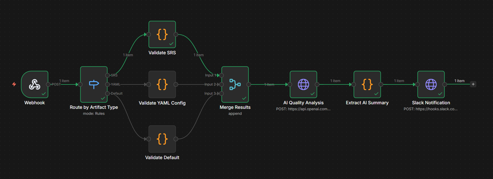
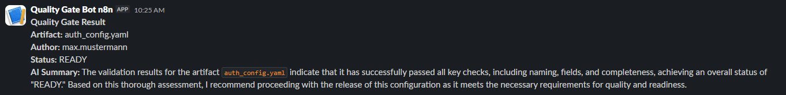
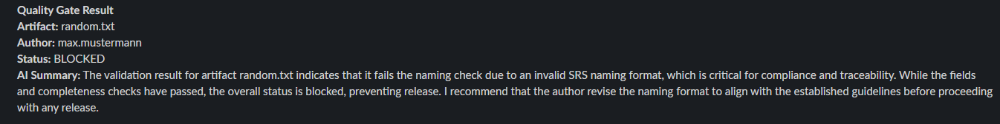

# 🔍 Engineering Artifact Quality Gate
### An AI-powered automation workflow built with n8n

This project implements an automated quality validation pipeline for engineering deliverables. It simulates a real-world release readiness gate — automatically validating incoming artifacts, routing them through type-specific rule checks, generating AI-assisted quality summaries, and delivering instant notifications to collaboration tools.

Built as a portfolio project to demonstrate practical skills in workflow automation, API integration, and AI-assisted quality engineering.

---

## 🎬 How It Works

When an engineering artifact is submitted via webhook, the workflow:

1. **Routes** the artifact to a specialized validator based on its type
2. **Runs deterministic checks** — naming conventions, required fields, completeness rules
3. **Generates an AI quality summary** using GPT-4o-mini
4. **Sends a Slack notification** with the gate result and AI recommendation

```
Webhook → Switch (Route by Type) → [Validate SRS / Validate YAML / Validate Default] → Merge → AI Analysis → Extract Summary → Slack Notification
```

---

## 🖼️ Workflow Canvas



---

## ✅ Validation Rules by Artifact Type

### Software Requirements Specification (SRS)
| Check | Rule |
|---|---|
| Naming Convention | Must match `SRS_<Module>_v<X.Y>.pdf` |
| Required Fields | `author`, `artifact_name`, `artifact_type`, `version` |
| Completeness | Description must be > 100 characters |
| Version | Must be ≥ 1.0 |

### YAML Config
| Check | Rule |
|---|---|
| Naming Convention | Must be lowercase, ending in `.yaml` or `.yml` |
| Required Fields | `author`, `artifact_name`, `artifact_type`, `version` |
| Completeness | Description must be > 20 characters |

### Default / Other
| Check | Rule |
|---|---|
| Naming Convention | Must be a valid filename with extension |
| Required Fields | `author`, `artifact_name`, `artifact_type` |
| Completeness | Description must be > 20 characters |

---

## 📸 Screenshots

### PASS Result — Slack Notification


### FAIL Result — Slack Notification


---

## 🚀 How to Run This Workflow

### Prerequisites
- [n8n](https://n8n.io) instance (cloud or self-hosted)
- OpenAI API key (GPT-4o-mini)
- Slack workspace with Incoming Webhooks enabled

### Setup
1. Clone this repo
2. Import `workflow.json` into your n8n instance via **Settings → Import**
3. Update the following credentials in n8n:
   - `AI Quality Analysis` node → add your OpenAI API key
   - `Slack Notification` node → add your Slack webhook URL
4. Activate the workflow
5. Send a POST request to your webhook URL

### Example Payload (SRS — PASS)
```json
{
  "author": "max.mustermann",
  "artifact_name": "SRS_AuthModule_v1.2_final.pdf",
  "artifact_type": "Software Requirements Specification",
  "version": "1.2",
  "description": "Requirements specification for the authentication module including login, logout, and session management features."
}
```

### Example Payload (YAML — PASS)
```json
{
  "author": "max.mustermann",
  "artifact_name": "auth_config.yaml",
  "artifact_type": "YAML Config",
  "version": "1.0",
  "description": "YAML configuration file for auth module."
}
```

### Example Payload (FAIL — wrong naming)
```json
{
  "author": "max.mustermann",
  "artifact_name": "random_file.txt",
  "artifact_type": "Software Requirements Specification",
  "version": "0.5",
  "description": "Test."
}
```

---

## 🛠️ Tech Stack

- **n8n** — workflow orchestration
- **JavaScript** — validation logic and data transformation
- **OpenAI GPT-4o-mini** — AI-assisted quality analysis
- **Slack Incoming Webhooks** — real-time notifications
- **REST/JSON** — artifact submission and API integration

---

## 📁 Repository Structure

```
artifact-quality-gate/
├── workflow.json          # n8n workflow export
├── README.md              # This file
├── screenshots/
│   ├── canvas.png         # n8n workflow canvas
│   ├── slack_pass.png     # Slack notification - PASS result
│   └── slack_fail.png     # Slack notification - FAIL result
└── payloads/
    ├── srs_pass.json      # Example SRS passing payload
    ├── yaml_pass.json     # Example YAML passing payload
    └── fail.json          # Example failing payload
```
